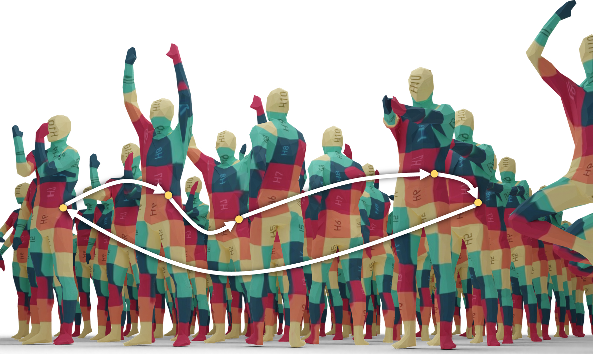

# CCuantuMM: Cycle-Consistent Quantum-Hybrid Matching of Multiple Shapes (CVPR 2023)
 
[Harshil Bhatia<sup>1,2</sup>](https://scholar.google.com/citations?user=8rU1AaQAAAAJ&hl=en), [Edith Tretschk<sup>2</sup>](https://people.mpi-inf.mpg.de/~tretschk/), [Zorah Lähner<sup>3</sup>](https://zorah.github.io/), [Marcel Seelbach Benkner<sup>3</sup>](https://www.vsa.informatik.uni-siegen.de/en/seelbach-marcel), [Michael Möller<sup>3</sup>](https://sites.google.com/site/michaelmoellermath/), [Christian Theobalt<sup>2</sup>](https://people.mpi-inf.mpg.de/~theobalt/) and [Vladislav Golyanik<sup>2</sup>](https://people.mpi-inf.mpg.de/~golyanik/)

<sup>1</sup> Indian Institute of Technology, Jodhpur , <sup>2</sup>Max Planck Institute for Informatics, <sup> 3 </sup> University of Siegen.

[Paper]() | 
[Code](https://github.com/HarshilBhatia/CCuantum) | 
[Project Page](https://4dqv.mpi-inf.mpg.de/QRNG/)



## Running the Code
The code can be executed directly on [D-Wave's Leap IDE](https://www.dwavesys.com/take-leap) or locally by installing [D-Wave Ocean SDK]( https://docs.ocean.dwavesys.com/en/stable/)

### Installation
If running the code locally, we recommend the user to create a virtual environment (optionally using conda)

```
conda env create -n ocean
pip install dwave-ocean-sdk
pip install pyqubo
```

The next step is to configure access to the Leap's Solvers. To achieve this, the user needs to create an account to gain access (a free account provides upto 1 minute of QPU time) to the solvers and retrieve their respective API tokens. Now run, 

``` dwave setup```

For more information related to the configuration please refer to this [guide](https://docs.ocean.dwavesys.com/en/stable/overview/sapi.html#sapi-access)

### Running 
Once the environment has been configured, we can run a 10 shape instance of the FAUST dataset on the first class using the following command 
```
python Main.py --dataset FAUST --classvalue 0 --num_shapes 10
```

To run the same instance on the Quantum Annealer:
```
python Main.py --dataset FAUST --classvalue 0 --num_shapes 10 --nrWorst 20 --qpu --num_reads 200
```

Note: This repository contains precomputed geodesics and point descriptors for a subsampled version of the [FAUST](http://faust.is.tue.mpg.de/. ) Dataset with one-to-one correspondences.

## Citation 
If you find our work useful in your research, please consider citing:

```
@inproceedings{bhatia2022CCuantuMM,
 title = {CCuantuMM: Cycle-Consistent Quantum-Hybrid Matching of Multiple Shapes},
 author = {Bhatia, Harshil and Tretschk, Edith and Lähner, Zorah and Benkner, Marcel and Möller, Michael and Theobalt, Christian and Golyanik, Vladislav },
 year = {2023},
 booktitle = {{IEEE Conference on Computer Vision and Pattern Recognition (CVPR)}},
 keywords = {Shape Analysis, Geometry Processing, Shape Correspondence, Multi Shape Matching},
}
```

## License
Permission is hereby granted, free of charge, to any person or company obtaining a copy of this software and associated documentation files (the "Software") from the copyright holders to use the Software for any non-commercial purpose. Publication, redistribution and (re)selling of the software, of modifications, extensions, and derivates of it, and of other software containing portions of the licensed Software, are not permitted. The Copyright holder is permitted to publically disclose and advertise the use of the software by any licensee.

Packaging or distributing parts or whole of the provided software (including code, models and data) as is or as part of other software is prohibited. Commercial use of parts or whole of the provided software (including code, models and data) is strictly prohibited. Using the provided software for promotion of a commercial entity or product, or in any other manner which directly or indirectly results in commercial gains is strictly prohibited.

THE SOFTWARE IS PROVIDED "AS IS", WITHOUT WARRANTY OF ANY KIND, EXPRESS OR IMPLIED, INCLUDING BUT NOT LIMITED TO THE WARRANTIES OF MERCHANTABILITY, FITNESS FOR A PARTICULAR PURPOSE AND NONINFRINGEMENT. IN NO EVENT SHALL THE AUTHORS OR COPYRIGHT HOLDERS BE LIABLE FOR ANY CLAIM, DAMAGES OR OTHER LIABILITY, WHETHER IN AN ACTION OF CONTRACT, TORT OR OTHERWISE, ARISING FROM, OUT OF OR IN CONNECTION WITH THE SOFTWARE OR THE USE OR OTHER DEALINGS IN THE SOFTWARE.
